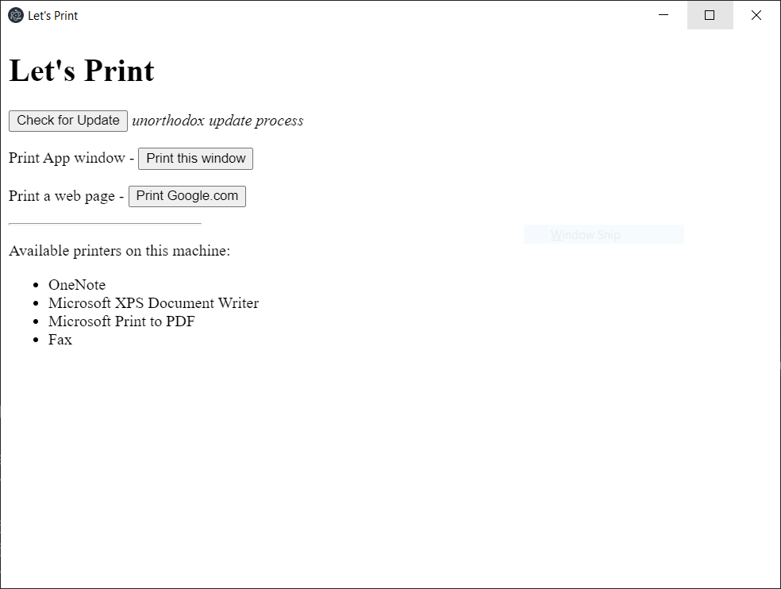

# Electron App

What does this application do:
* Prints contents of its own application window and a external web page.
* Shows progress on taskbar while loadig the web page.
* Shows OS level notification when printing is done.

`contextIsolation` (`contextBridge`) is used. To improve security, *Electron* team deprecated `nodeIntegration` flag and `contextIsolation` will be enabled by default from *Electron 12*.

### How to up n run the project:
Go to project directory and run commands
* `npm install`
* `npm start`

### Screenshots

Print Output (in PDF)

---
TareqNewazShahriar
